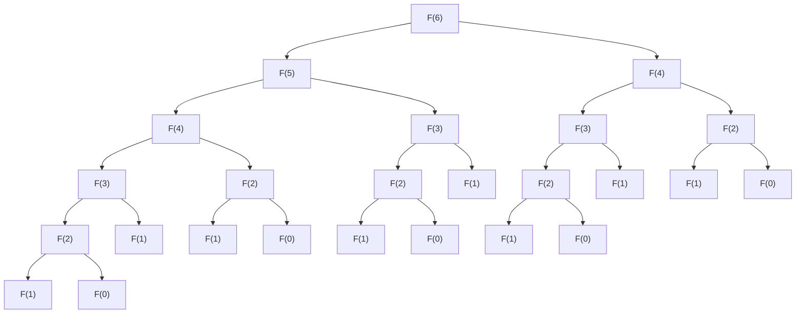

# Fibonacci-Sequence
In this repository I discuss multiple different ways of calculating the fibonacci sequence.

## Table of Contents
  - [What is the Fibonacci Sequence](#what-is-the-fibonacci-sequence)
  - [Iteration](#iteration)
  - [Recursion](#recursion)
  - [Dynamic Programming with Memoization](#dynamic-programming-with-memoization)
  - [Matrix Exponentiation](#matrix-exponentiation)
  - [Fast Doubling](#fast-doubling)
  - [Binet's Formula](#binets-formula)

## What is the Fibonacci Sequence
The Fibonacci Sequence is a sequence in mathematics in which each term is the sum of the 2 previous terms. The recursive mathematival definition is F(n) = F(n-1) + F(n-2). The first 2 terms are 0 and 1, and then the sequence continues as 1,2,3,5,8 etc. Sometimes the first 2 terms are defined as 1 and 1 instead of 0 and 1.

## Iteration
One of the easiest ways to compute the nth term in the fibonacci sequence is by using a simple for loop starting from the first 2 terms(0 and 1) and building your way upwards towards the term you are looking for(bottom-up approach). Therefore, the code would look something like this in C++:
```
__uint128_t iteration(unsigned int n) {
    if (n <= 1) return n;
    __uint128_t a=0,b=1;
    for (int i = 2; i<=n; i++) {
        b += a;
        a = b-a;
    }
    return b;
}
```
This algorithm is of course not optimal as it unecessarily calculates all terms of the Fibonacci sequence up until the one you are looking for whereas it should only be calculating the nth term. The asymptotic time notation is O(n) so this method is only useful when trying to calculate mutliple terms of the sequence.

## Recursion
The most straightforward and easy way to tackle this problem is to use recursion. We take advantage of the fact that F(n) = F(n-1) + F(n-2) and plug it directly into a nice recursive function with a simple base case of when n <= 1 then it should just return n(F(0) = 0, F(1) = 1). This means that the code needed is just a few lines, like so:
```
__uint128_t recursion(unsigned int n) {
    if (n <= 1) return n;
    return recursion(n-1) + recursion(n-2);
}
```
Even though this is very simple to code, its asymptotic time notation is roughly O(2^n), which is superpolynomial and will therefore need a lot of time to calculate even the 50th term. However, it helps us build the next solution with dynamic programming and memoization which is a lot more efficient.

## Dynamic Programming with Memoization
This solution improves upon the plain recursive function that we built. So, what makes the recursive solution so slow? The reason lies in the fact that it is constantly calculating terms which we have already calculated previously. This can be demonstrated by the diagram below which shows how F(6) is calculated:

As you can clearly see with just a call to F(6) we are calling the function 25 times to figure out just the 6th term of the sequence. Pretty slow. So how could we avoid repeating the same call to the function with the same exact arguments? Well, we could use a concept called memoization which basically saves all of our previous solutions in a data structure, which in this case we'll use a hash map, although you could also use an array or a vector(it's actually better to use an array or vector of size n for this case). So every time we find F(n) we store it in our nice little map and if we ever happen to make a call to the function to calculate F(n) again then we can just return what we have saved in our map. So with an extra 2 lines of code we have immensely increased the efficiency of our algorithm.
```
__uint128_t dynamic(unsigned int n, std::map<unsigned int, __uint128_t>& fib) {
    if (n <= 1) return n;
    if (fib.find(n) != fib.end()) return fib[n];
    fib[n] = dynamic(n-1, fib) + dynamic(n-2, fib);
    return fib[n];
}
```
and we can also overload the function so that it accepts a call with only one parameter if you are not going to use the map again.
```
__uint128_t dynamic(unsigned int n) {
    std::map<unsigned int, __uint128_t> fib;
    return dynamic(n, fib);
}
```
And that's it. This solution is also completed. It is very short and relatively fast compared to our last solution. It's asymptotic time notation is O(n) as it only calculates each term once, and it basically is like our iterative solution but it starts from the last term and goes towards the first 2(top-down approach). So, this is also not optimal as it calculates a lot of unnecessary terms and also takes up a lot of space.

## Matrix Exponentiation
Another way to find the nth term of this sequence is by utilising matrix exponentiation. This is the formula we are going to base our algorithm off:
```math
\begin{bmatrix} F(n) \\\ F(n-1) \end{bmatrix} = \begin{bmatrix} 1 & 1 \\\ 1 & 0 \end{bmatrix}^{n-1} \begin{bmatrix} F(1) \\\ F(0) \end{bmatrix}
```
To verify this formula we can do it this way. Let's assume that the following is true:
```math
\begin{bmatrix} F(n) \\\ F(n-1) \end{bmatrix} = \begin{bmatrix} 1 & 1 \\\ 1 & 0 \end{bmatrix} \begin{bmatrix} F(n-1) \\\ F(n-2) \end{bmatrix}
```
This is easier to verify as by just multiplying the matrices we get: $`1*F(n-1) + 1*F(n-2) = F(n)`$(first value)<br>
Then the second value of the matrix is just $`1*F(n-1) + 0*F(n-2) = F(n-1)`$. This means that we substitute the matrix on the right like so:
```math
\begin{bmatrix} F(n) \\\ F(n-1) \end{bmatrix} = \begin{bmatrix} 1 & 1 \\\ 1 & 0 \end{bmatrix} \begin{bmatrix} 1 & 1 \\\ 1 & 0 \end{bmatrix} \begin{bmatrix} F(n-2) \\\ F(n-3) \end{bmatrix}
```
Then we can just keep on replacing the matrix on the right side by its matrix definition and at the end we are just going to get:
```math
\begin{bmatrix} F(n) \\\ F(n-1) \end{bmatrix} = \begin{bmatrix} 1 & 1 \\\ 1 & 0 \end{bmatrix}^{n-1} \begin{bmatrix} F(1) \\\ F(0) \end{bmatrix}
```
where F(1) = F(0) = 1.
<br>
Now this problem has just turned into an exponentiation problem. The fastest way to raise a matrix(or a number) to a value is by utilisng exponentiation by squaring which uses a Divide and Conquer algoirthm to quickly calculate the power. This calculation has an asymptotic time notation of O(logn). The way it works is simple, it takes advantage of one the powers properties which is $`(x^a)^b=x^{a*b}`$. So if you have an even exponent you can just find its value by first figuring out how much $`a^{n/2}`$ is and then multiplying it by itself. If it's odd just multiply the base by the power but now with an even exponent which will utilise the same technique. Now if you do this recursively and with a base case you can very easily find the power of any number(or matrix in this case) raised to the power of n.
<br>
The main 2 functions will therefore be:
```
using Matrix = std::vector<std::vector<__uint128_t> >;

Matrix power(Matrix ma, int exp) {
    if (exp <= 1) return ma;
    if (exp&1) return multiply(power(ma, exp-1), ma);
    Matrix half = power(ma, exp/2);
    return multiply(half, half);
}

__uint128_t matrix(unsigned int n) {
    if (n <= 0) return 0;
    if (n <= 2) return 1;
    if (n == 3) return 2;
    
    std::vector<__uint128_t> temp(2, 1);
    Matrix m;
    m.push_back(temp);
    temp.clear(); temp.push_back(1);temp.push_back(0);
    m.push_back(temp);
    int exponent = n-3;
    Matrix f = power(m, exponent);
    __uint128_t sum = 0;
    for (auto y: f) {
        for (auto x: y) {
            sum += x;
        }
    }
    return sum;
}
```
You may notice how this algorithm is only calculating the matrix to the power of n-3 instead of n-1. Well at n-3 the matrix will look like this:
```math
\begin{bmatrix} F(n-2) & F(n-3) \\\ F(n-3) & F(n-4) \end{bmatrix}
```
So if we just sum up all of these terms we will once again get F(n) because $`(F(n-2) + F(n-3)) + (F(n-3) + F(n-4)) = F(n-1) + F(n-2) = F(n)`$.
<br>
So at the end the final asymptotic time notation of this algorithm comes mainly from the exponentiation which we optimized and it's just O(n).

## Fast Doubling


## Binet's Formula
Now let's look at a way to calculate the nth term of the Fibonacci sequence in constant time. Is there a single mathematical formula to calculate a term so fast. Well there is, and to calculate it we use Binet's formula which was named after the mathematician who derived it, Jacques Philippe Marie Binet. The formula is the following:
```math
F(n) = \frac{1}{\sqrt{5}} \left[\left(\frac{1+\sqrt{5}}{2} \right)^{\!n} - \left(\frac{1-\sqrt{5}}{2} \right)^{\!n}\right]
```
There are a lot of methods of deriving this formula, however, we will make a simple observation based off the quadratic:
```math
x^2 = x + 1
```
Now if we write what $`x^n`$ is by increasing the n each time by 1 we will see a correlation to the Fibonacci sequence.
```math
\displaylines
{
x^2 = x + 1 \\
x^3 = x(x + 1) = x^2 + x = (x + 1) + x = 2x + 1 \\
x^4 = x(2x + 1) = 2x^2 + x = 2x + 2 + x = 3x + 2 \\
x^5 = x(3x + 2) = 3(x+1) + 2x = 5x + 3 \\
x^6 = 8x + 5 \\
x^7 = 13x + 8 \\
x^8 = 21x + 13 \\
...
}
```
If we take a look at the results we can see that $`x^n = F(n)*x + F(n-1)`$
So we are now trying to find what F(n) equals to based on this equation. We can substitute x with its solutions for the equation $`x^2 - x - 1`$ which by using the quadratic formula we'll get:
```math
\displaylines{
x_1 = \frac{1+\sqrt{5}}{2} \\
x_2 = \frac{1-\sqrt{5}}{2}
}
```
These solutions must also satisfy our new equation so by plugging them in we'll get:

```math
\displaylines{
x_1^n = F(n)*x_1 + F(n-1) \\
x_2^n = F(n)*x_2 + F(n-1)
}
```
Now if we solve this system of equations:
```math
\displaylines{
x_1^n - x_2^n = F(n)*x_1 + F(n-1) - (F(n)*x_2 + F(n-1)) \\
x_1^n - x_2^n = F(n) * (x_1 - x_2) \\
F(n) = \frac{1}{\frac{1+\sqrt{5}}{2} - \frac{1-\sqrt{5}}{2}} (x_1^n - x_2^n) \\
F(n) = \frac{1}{\sqrt{5}} \left[\left(\frac{1+\sqrt{5}}{2} \right)^{\!n} - \left(\frac{1-\sqrt{5}}{2} \right)^{\!n}\right]
}
```


