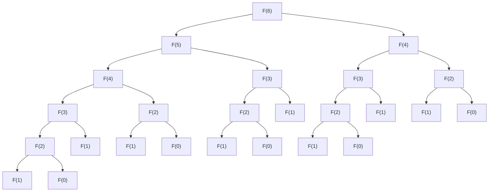

# Fibonacci-Sequence
In this repository I discuss multiple different ways of calculating the Fibonacci sequence.

## Table of Contents
  - [What is the Fibonacci Sequence](#what-is-the-fibonacci-sequence)
  - [Iteration](#iteration)
  - [Recursion](#recursion)
  - [Dynamic Programming with Memoization](#dynamic-programming-with-memoization)
  - [Matrix Exponentiation](#matrix-exponentiation)
  - [Fast Doubling](#fast-doubling)
  - [Binet's Formula](#binets-formula)
  - [Limitations and More](#limitations-and-more)
  - [Bibliography](#bibliography)

## What is the Fibonacci Sequence
The Fibonacci Sequence is a sequence in mathematics in which each term is the sum of the 2 previous terms. The recursive mathematival definition is $`F(n) = F(n-1) + F(n-2)`$. The first 2 terms are 0 and 1, and then the sequence continues as 1,2,3,5,8 etc. Sometimes the first 2 terms are defined as 1 and 1 instead of 0 and 1.

## Iteration
One of the easiest ways to compute the nth term in the fibonacci sequence is by using a simple for loop starting from the first 2 terms(0 and 1) and building your way upwards towards the term you are looking for(bottom-up approach). Therefore, the code would look something like this in C++:
```
__uint128_t iteration(unsigned int n) {
    if (n <= 1) return n;
    __uint128_t a=0,b=1;
    for (int i = 2; i<=n; i++) {
        b += a;
        a = b-a;
    }
    return b;
}
```
This algorithm is of course not optimal as it unecessarily calculates all terms of the Fibonacci sequence up until the one you are looking for whereas it should only be calculating the nth term. The asymptotic time notation is $`O(n)`$ so this method is only useful when trying to calculate mutliple terms of the sequence.

## Recursion
The most straightforward and easy way to tackle this problem is to use recursion. We take advantage of the fact that $`F(n) = F(n-1) + F(n-2)`$ and plug it directly into a nice recursive function with a simple base case of when $`n \leq 1`$ then it should just return n(F(0) = 0, F(1) = 1). This means that the code needed is just a few lines, like so:
```
__uint128_t recursion(unsigned int n) {
    if (n <= 1) return n;
    return recursion(n-1) + recursion(n-2);
}
```
Even though this is very simple to code, its asymptotic time notation is roughly $`O(2^n)`$, which is superpolynomial and will therefore need a lot of time to calculate even the 50th term. However, it helps us build the next solution with dynamic programming and memoization which is a lot more efficient.

## Dynamic Programming with Memoization
This solution improves upon the plain recursive function that we built. So, what makes the recursive solution so slow? The reason lies in the fact that it is constantly calculating terms which we have already calculated previously. This can be demonstrated by the diagram below which shows how $`F(6)`$ is calculated:

As you can clearly see with just a call to $`F(6)`$ we are calling the function 25 times to figure out just the 6th term of the sequence. Pretty slow. So how could we avoid repeating the same call to the function with the same exact arguments? Well, we could use a concept called memoization which basically saves all of our previous solutions in a data structure, which in this case we'll use a hash map, although you could also use an array or a vector(it's actually better to use an array or vector of size n for this case). So every time we find $`F(n)`$ we store it in our nice little map and if we ever happen to make a call to the function to calculate $`F(n)`$ again then we can just return what we have saved in our map. So with an extra 1 line of code we have immensely increased the efficiency of our algorithm.
```
__uint128_t dynamic(unsigned int n, std::map<unsigned int, __uint128_t>& fib) {
    if (n <= 1) return n;
    if (fib.find(n) != fib.end()) return fib[n];
    return (fib[n] = dynamic(n-1, fib) + dynamic(n-2, fib));
}
```
and we can also overload the function so that it accepts a call with only one parameter if you are not going to use the map again.
```
__uint128_t dynamic(unsigned int n) {
    std::map<unsigned int, __uint128_t> fib;
    return dynamic(n, fib);
}
```
And that's it. This solution is also completed. It is very short and relatively fast compared to our last solution. It's asymptotic time notation is $`O(n)`$ as it only calculates each term once, and it basically is like our iterative solution but it starts from the last term and goes towards the first 2(top-down approach). So, this is also not optimal as it calculates a lot of unnecessary terms and also takes up a lot of space.

## Matrix Exponentiation
Another way to find the nth term of this sequence is by utilising matrix exponentiation. This is the formula we are going to base our algorithm off:
```math
\begin{bmatrix} F(n) \\\ F(n-1) \end{bmatrix} = \begin{bmatrix} 1 & 1 \\\ 1 & 0 \end{bmatrix}^{n-1} \begin{bmatrix} F(1) \\\ F(0) \end{bmatrix}
```
To verify this formula we can do it this way. Let's assume that the following is true:
```math
\begin{bmatrix} F(n) \\\ F(n-1) \end{bmatrix} = \begin{bmatrix} 1 & 1 \\\ 1 & 0 \end{bmatrix} \begin{bmatrix} F(n-1) \\\ F(n-2) \end{bmatrix}
```
This is easier to verify as by just multiplying the matrices we get: $`1*F(n-1) + 1*F(n-2) = F(n)`$(first value)<br>
Then the second value of the matrix is just $`1*F(n-1) + 0*F(n-2) = F(n-1)`$. This means that we substitute the matrix on the right like so:
```math
\begin{bmatrix} F(n) \\\ F(n-1) \end{bmatrix} = \begin{bmatrix} 1 & 1 \\\ 1 & 0 \end{bmatrix} \begin{bmatrix} 1 & 1 \\\ 1 & 0 \end{bmatrix} \begin{bmatrix} F(n-2) \\\ F(n-3) \end{bmatrix}
```
Then we can just keep on replacing the matrix on the right side by its matrix definition and at the end we are just going to get:
```math
\begin{bmatrix} F(n) \\\ F(n-1) \end{bmatrix} = \begin{bmatrix} 1 & 1 \\\ 1 & 0 \end{bmatrix}^{n-1} \begin{bmatrix} F(1) \\\ F(0) \end{bmatrix}
```
We can do some more adjustments here like so:
```math
\begin{bmatrix} F(n+1) & F(n) \\\ F(n) & F(n-1) \end{bmatrix} = \begin{bmatrix} 1 & 1 \\\ 1 & 0 \end{bmatrix}^n \begin{bmatrix} F(1) & F(0) \\\ F(0) & F(-1) \end{bmatrix}
```
And because $`F(1) = 1, F(0) = 0, F(-1) = 1`$ we can therefore just say that:
```math
\begin{bmatrix} F(n+1) & F(n) \\\ F(n) & F(n-1) \end{bmatrix} = \begin{bmatrix} 1 & 1 \\\ 1 & 0 \end{bmatrix}^n
```
<br>

Now this problem has just turned into an exponentiation problem. The fastest way to raise a matrix(or a number) to a value is by utilisng exponentiation by squaring which uses a Divide and Conquer algoirthm to quickly calculate the power. This calculation has an asymptotic time notation of $`O(\log_n)`$. The way it works is simple, it takes advantage of one of the power properties which is $` (x^a)^b=x^{a*b}`$. So if you have an even exponent you can just find its value by first figuring out how much $`a^{\frac{n}{2}}`$ is and then multiplying it by itself. If it's odd just multiply the base by the power but now with an even exponent which will utilise the same technique. Now if you do this recursively and with a base case you can very easily find the power of any number(or matrix in this case) raised to the power of n.
<br>
The main 2 functions will therefore be:

```
using Matrix = std::vector<std::vector<__uint128_t> >;

Matrix power(Matrix ma, int exp) {
    if (exp <= 1) return ma;
    if (exp&1) return multiply(power(ma, exp-1), ma);
    Matrix half = power(ma, exp/2);
    return multiply(half, half);
}

__uint128_t matrix(unsigned int n) {
    if (n <= 0) return 0;
    if (n <= 2) return 1;
    if (n == 3) return 2;
    
    std::vector<__uint128_t> temp(2, 1);
    Matrix m;
    m.push_back(temp);
    temp.clear(); temp.push_back(1);temp.push_back(0);
    m.push_back(temp);
    int exponent = n-3;
    Matrix f = power(m, exponent);
    __uint128_t sum = 0;
    for (auto y: f) {
        for (auto x: y) {
            sum += x;
        }
    }
    return sum;
}
```
You may notice how this algorithm is only calculating the matrix to the power of $`n-3`$ instead of $`n`$. Well at $`n-3`$ the matrix will look like this:
```math
\begin{bmatrix} F(n-2) & F(n-3) \\\ F(n-3) & F(n-4) \end{bmatrix}
```
So if we just sum up all of these terms we will once again get $`F(n)`$ because $`(F(n-2) + F(n-3)) + (F(n-3) + F(n-4)) = F(n-1) + F(n-2) = F(n)`$.
<br>
So at the end the final asymptotic time notation of this algorithm comes mainly from the exponentiation which we optimized and it's just $`O(\log_n)`$.

## Fast Doubling
Calculating the nth term by the method of fast doubling is the most efficient and preferred solution when aiming for time optimization. We will use a bit of recursion again but this time we'll use the following formulas:
```math
\displaylines
{
F(2n) = F(n)*[2F(n+1) - F(n)] \\
F(2n + 1) = F(n+1)^2 + F(n)^2
}
```
These formulas are just derived from the matrix exponentiation method. If we plug in 2n we'll get:
```math
\displaylines
{
\begin{bmatrix} F(2n+1) & F(2n) \\\ F(2n) & F(2n-1) \end{bmatrix} = \begin{bmatrix} 1 & 1 \\\ 1 & 0 \end{bmatrix}^{2n} \\\
\begin{bmatrix} F(2n+1) & F(2n) \\\ F(2n) & F(2n-1) \end{bmatrix} = \begin{bmatrix} 1 & 1 \\\ 1 & 0 \end{bmatrix}^{n} \begin{bmatrix} 1 & 1 \\\ 1 & 0 \end{bmatrix}^{n} \\\
\begin{bmatrix} F(2n+1) & F(2n) \\\ F(2n) & F(2n-1) \end{bmatrix} = \begin{bmatrix} F(n+1) & F(n) \\\ F(n) & F(n-1) \end{bmatrix} \begin{bmatrix} F(n+1) & F(n) \\\ F(n) & F(n-1) \end{bmatrix} \\\
\begin{bmatrix} F(2n+1) & F(2n) \\\ F(2n) & F(2n-1) \end{bmatrix} = \begin{bmatrix} F(n+1)F(n+1)+F(n)F(n) & F(n+1)F(n)+F(n)F(n-1) \\\ F(n)F(n+1)+F(n-1)F(n) & F(n)F(n)+F(n-1)F(n-1) \end{bmatrix} \\\
\begin{bmatrix} F(2n+1) & F(2n) \\\ F(2n) & F(2n-1) \end{bmatrix} = \begin{bmatrix} F(n+1)^2 + F(n)^2 & F(n)[F(n+1)+F(n-1)] \\\ F(n)[F(n+1)+F(n-1)] & F(n)^2+F(n-1)^2 \end{bmatrix}
}
```
So we now know the following:
```math
\displaylines
{
F(2n+1) = F(n+1)^2 + F(n)^2 \\
F(2n) = F(n)[F(n+1) + F(n-1)] \\
F(2n) = F(n)\{F(n+1) + [F(n+1)-F(n)]\} \\
F(2n) = F(n)[2F(n+1) - F(n)]
}
```
Now let's look at the code for this formulas. First, we are going to make a simple recursive version with some memoization, kind of how we did in the [Dynamic Programming solution](#dynamic-programming-with-memoization) but with different formulas. So the code would look something like this:
```
__uint128_t fast_unoptimized(unsigned int n, std::map<unsigned int, __uint128_t>& map) {
    if (n == 0) return n;
    if (n <= 2) return 1;
    if (map.find(n) != map.end()) return map[n];

    unsigned int k = n>>1;
    __uint128_t a = fast_unoptimized(k, map);
    __uint128_t b = fast_unoptimized(k+1, map);
    
    if (n&1) {
        return (map[n] = b*b + a*a);
    }
    return (map[n] = a*(2*b-a));
}
```
As you can see we have our base cases, we calculate $`F(\frac{n}{2}+1)`$ and $`F(\frac{n}{2})`$ recursively and then plug it right into the formula which we had above, depending on if it's even or odd we use the appropriate one. You can also observe how we are using memoization again in order to avoid calculating some solutions over and over again. This algoirthm although being very fast can be optimized in order to use less space. Actually, the only thing we need to save is an array of only 2 elements.
<br>
We want our function to return an array of 2 elements, containing $`F(n)`$ and $`F(n+1)`$. When n is even we can just apply our formulas above to calculate both $`F(n)`$ and $`F(n+1)`$, but when n is odd we can apply our formulas to calculate $`F(n-1)`$ and $`F(n)`$ and then we can add them up to get $`F(n+1)`$. With this in mind we can make the following adjustments to our program:
```
std::vector<__uint128_t> helper(__uint128_t n) {
    std::vector<__uint128_t> r;
    if (!n) {
        r.push_back(0);
        r.push_back(1);
        return r;
    }

    std::vector<__uint128_t> f = helper(n>>1);
    __uint128_t a = f[0];
    __uint128_t b = f[1];

    __uint128_t c = a*(2*b-a);
    __uint128_t d = b*b + a*a;

    if (n&1) {
        r.push_back(d);
        r.push_back(c+d);
    }
    else {
        r.push_back(c);
        r.push_back(d);
    }
    return r;
}

__uint128_t fast(unsigned int n) {
    return helper(n)[0];
}
```
This is the final version of the fast doubling method, it has an asymptotic time notation of $`O(\log_n)`$ but it is actually faster than the matrix solution as its hidden constant term is lower. It could be improved by using arrays however I preferred vectors. So this is the fastest solution discussed here that works for large n. The next one, even though faster, fails to accurately work for large n.

## Binet's Formula
Now let's look at a way to calculate the nth term of the Fibonacci sequence in constant time. Is there a single mathematical formula to calculate a term so fast. Well there is, and to calculate it we use Binet's formula which was named after the mathematician who derived it, Jacques Philippe Marie Binet. The formula is the following:
```math
F(n) = \frac{1}{\sqrt{5}} \left[\left(\frac{1+\sqrt{5}}{2} \right)^{\!n} - \left(\frac{1-\sqrt{5}}{2} \right)^{\!n}\right]
```
There are a lot of methods of deriving this formula, however, we will make a simple observation based off the quadratic:
```math
x^2 = x + 1
```
Now if we write what $`x^n`$ is by increasing the n each time by 1 we will see a correlation to the Fibonacci sequence.
```math
\displaylines
{
x^2 = x + 1 \\
x^3 = x(x + 1) = x^2 + x = (x + 1) + x = 2x + 1 \\
x^4 = x(2x + 1) = 2x^2 + x = 2x + 2 + x = 3x + 2 \\
x^5 = x(3x + 2) = 3(x+1) + 2x = 5x + 3 \\
x^6 = 8x + 5 \\
x^7 = 13x + 8 \\
x^8 = 21x + 13 \\
...
}
```
If we take a look at the results we can see that $`x^n = F(n)*x + F(n-1)`$
So we are now trying to find what $`F(n)`$ equals to based on this equation. We can substitute x with its solutions for the equation $`x^2 - x - 1`$ which by using the quadratic formula we'll get:
```math
\displaylines{
x_1 = \frac{1+\sqrt{5}}{2} \\
x_2 = \frac{1-\sqrt{5}}{2}
}
```
These solutions must also satisfy our new equation so by plugging them in we'll get:

```math
\displaylines{
x_1^n = F(n)*x_1 + F(n-1) \\
x_2^n = F(n)*x_2 + F(n-1)
}
```
Now if we solve this system of equations:
```math
\displaylines{
x_1^n - x_2^n = F(n)*x_1 + F(n-1) - (F(n)*x_2 + F(n-1)) \\
x_1^n - x_2^n = F(n) * (x_1 - x_2) \\
F(n) = \frac{1}{\frac{1+\sqrt{5}}{2} - \frac{1-\sqrt{5}}{2}} (x_1^n - x_2^n) \\
F(n) = \frac{1}{\sqrt{5}} \left[\left(\frac{1+\sqrt{5}}{2} \right)^{\!n} - \left(\frac{1-\sqrt{5}}{2} \right)^{\!n}\right]
}
```
Now we have verified that our formula is true for any case. The implementation is like this:
```
long long binet(unsigned int n) {
    return (long double)(pow((long double)(1+(long double)sqrt(5))/2, n)-pow((long double)(1-(long double)sqrt(5))/2, n))/sqrt(5);
}
```
I used typecasting as much as possible to keep as much precision in the calculations as possible with a long double. However, obviously this formula has limitations as even with a long double it starts to lose precision after roughly the 70th term, so even though its asymptotic time notation is $`O(1)`$ it actually isn't the preferred solution when solving such problems due to floating point inaccuracies(technically speaking it's actually $`O(\log_n)`$ due to the power). In reality, if you were doing it by hand you would see that the irrational parts of the equation would cancel out and therefore the solution will end up being an integer.

## Limitations and More
All of these methods are nice but which one is the best and for which cases. As discussed above Binet's formula is best when doing the calculations by hand, or when trying to use it for small values of n for the computer. Fast doubling and matrix exponentiation are the fastest for large values of n however, fast doubling is slightly faster. Then when trying to calculate all values of the fibonacci sequence up until a limit, then the simple iterative version is probably your best friend. The simple recursive solution is very slow and shouldn't really be used for any case, and the dynamic one is also not the best but introduces some very interesting concepts of programming so even though it's not optimal, you can see how it is related to a lot of other problems. 
<br>
I wrote all these solutions in C++ in which I decided to use the biggest built-in integer, __uint128_t which is an unsigned 128-bit integer, meaning it can hold values from 0 all the way to $`2^{128}-1`$, which is a very big number, but when compared to the exponential growth of the fibonacci sequence, it is nothing. Actually, after a simple test I found out that $`F(186)`$ is the biggest value that an unsigned 128-bit integer can hold. With such small n, time complexities don't really matter of course(except for the terrible $`O(2^n)`$, which takes more than a second even for the 40th term). Therefore, for bigger numbers in C++ you would need to use GMP, specifically the gmpxx.h library. However, I decided to just implement the Javascript solutions and use BigInteger() which can hold some very large numbers inside. For example it can calculate even the millionth term which is 208988 digits long. Yeah massive. If you use GMP with C++ I am sure you can also do that and even better as C++ is generally faster.
<br>
There is another algorithm which takes advantage of the Lucas numbers, which are very similar with the Fibonacci sequence but start with 2 and 1 instead. There is a correlation between the Fibonacci numbers and the Lucas numbers, and if you carefully examine them you can extract some more formulas which you can then apply for $`O(log_n)`$ time complexity, but this time again with a smaller constant term, making it better than the fast doubling method. You can check out [this](https://stackoverflow.com/questions/14661633/finding-out-nth-fibonacci-number-for-very-large-n/48171368#48171368) stack overflow answer which gives a detailed explanation concerning these solutions.
<br>
The Fibonacci Sequence is truly amazing and magical. There are so many patterns and other interesting stuff found inside of it. For example, one of the roots in the matrix exponentiation problem which we calculated was the golden ratio $`φ`$. There is also the case of calculating the Fibonacci sequence for negative n or even finding the gcd between one or more of its terms which results in a pretty interesting result. There are truly way too many aspects to explore related to this sequence, and this repository only talks about a fraction of the sequence's potential and applications.

## Bibliography
 - Ashwanth K. "Matrix Exponentiation". _Medium_. August 25th. Spider R&D. www.medium.com/spidernitt/matrix-exponentiation-acd80b217d16
 - Chun-Min Chang. "Matrix Difference Equation for Fibonacci Sequence". _chunminchang_. August 22 2017. https://chunminchang.github.io/blog/post/matrix-difference-equation-for-fibonacci-sequence
 - Chun-Min Chang. "Calculating Fibonacci Numbers by Fast Doubling". _chunminchang_. August 31 2017. https://chunminchang.github.io/blog/post/calculating-fibonacci-numbers-by-fast-doubling
 - Tyagi Adarsh. "Fibonacci in Constant Time". _Medium_. May 22 2022. www.medium.com/@adarshtyagi/fibonacci-in-constant-time-945546c9e64c
 - peelybonehead. "Binet's Formula". _Art of Problem Solving_. www.artofproblemsolving.com/wiki/index.php/Binet%27s_Formula


